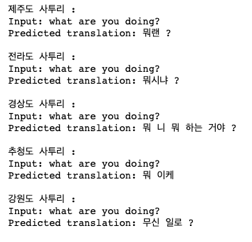
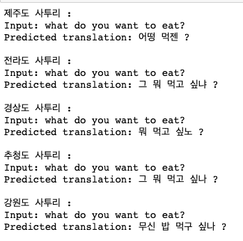
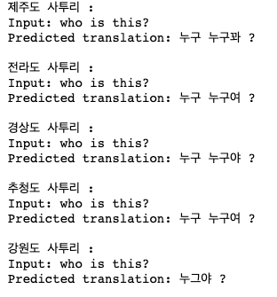
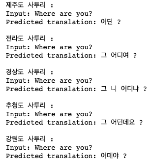

# AIFFELTHON Final Project Repository 
# `saturi translator`
- #### last update : MAR 31, 2023
---
## Team name : Saturi
## Participants :

| name | role |
|------|-----|
|1. SY| (lead)|
|2. SH| (model)
|3. SA| (data)|
|4. JI| (model|
|5. DS| (coordinator)|
|6. HW| (coordinator)|

# Description :
- ### This is a repository that contains code for Eng-to-Korean dialect translation Webapp.
- ### We used kor-dialect corpus data downloaded from AIHUB(aihub.or.kr). 
 

# How to use :
- ### download checkpoint -> please email me if you want to try(seuyon0101@gmail.com).
- ### python main.py
- ### insert tokenizer type
- ### vocab size small? Yes(8k vocab) , No(16k vocab)
- ### add region tag before input text

# Example :

- basic transformer model inference :

